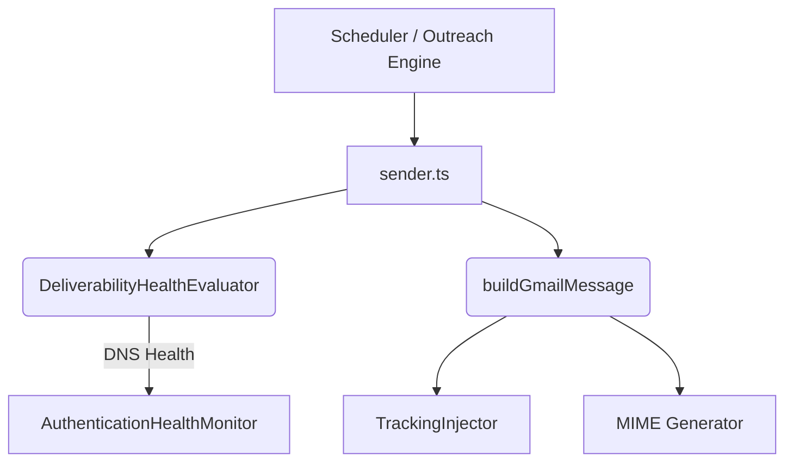

# Deliverability Pipeline V2 Runbook

This document serves as the operational runbook and architectural governance guide for the Deliverability Engine.

## 1. Ownership Matrix

| Component | Owner | Responsibility |
| :--- | :--- | :--- |
| `sender.ts` | Deliverability Engine | Orchestration, execution, and step fulfillment |
| `DeliverabilityHealthModel.ts` | Safety Engine | Pure evaluation of DNS and reputation health |
| `TrackingInjector.ts` | Tracking Engine | Insertion/stripping of engagement pixels |
| `message.ts` | Core | MIME generation and RFC 5322 compliance |

> [!CAUTION]
> **No duplicate implementations are allowed.** If another subsystem requires deliverability logic, it MUST call `DeliverabilityHealthEvaluator.evaluateHealth()`.

## 2. Architecture Overview & Dependency Graph

- The Pipeline acts as an **advisory layer**. If `AuthenticationHealthMonitor` encounters a temporary DNS failure (ENOTFOUND), it degrades gracefully (returns `HEALTHY`) rather than crashing the loop, proving proven recovery behavior.

## 3. Public Contracts

- `StepForSend`: The primary Data Transfer Object representing an email scheduled for delivery.
- **Contract Stability:** No Phase 1–8 schemas were modified.

## 4. Deployment Guide

- The pipeline is guarded by a feature flag `DELIVERABILITY_PIPELINE_V2`.
- When set to `"true"`, `sender.ts` routes through the new `DeliverabilityHealthEvaluator`.

## 5. Rollback Guide

If an issue occurs in production (e.g., elevated spam complaints or blocklisted IPs):
1. Navigate to Railway Dashboard.
2. Edit the environment variable `DELIVERABILITY_PIPELINE_V2` and set it to `"false"`.
3. Restart the worker instances.
4. The system will seamlessly fall back to V1 logic, ignoring the Health Evaluator completely. No database migrations or code rollbacks are required.

## 6. Troubleshooting

- **Email Missing List-Unsubscribe:** Ensure `ENABLE_LIST_UNSUBSCRIBE=true`.
- **Emails going to Spam:** Check `TRACKING_STRATEGY`. If you do not have a dedicated tracking domain, set it to `Disabled` or `SharedDomain` to automatically strip tracking pixels and preserve domain reputation.
